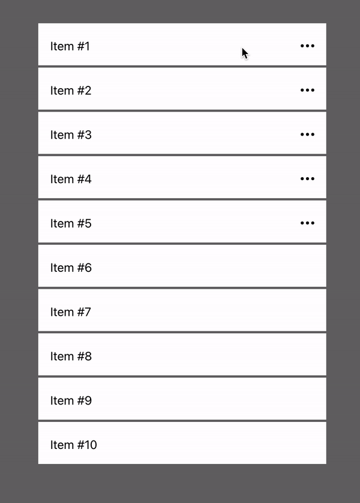

<h1 align="center">react-swipe-to-reveal-actions 👋</h1>
<p>
  
  <a href="https://github.com/nicklassvendsrud/react-swipe-to-reveal-actions#readme" target="_blank">
    
  </a>
  <a href="https://github.com/nicklassvendsrud/react-swipe-to-reveal-actions/graphs/commit-activity" target="_blank">
    
  </a>
  <a href="https://github.com/nicklassvendsrud/react-swipe-to-reveal-actions/blob/main/LICENSE" target="_blank">
    
  </a>
</p>

> A swipeable (list) item component that can reveal a set of actions - iOS style. Uses [react-swipeable](https://github.com/FormidableLabs/react-swipeable) for gesture detection.

### 🏠 [Homepage](https://github.com/nicklassvendsrud/react-swipe-to-reveal-actions#readme)



## Install

```sh
yarn add react-swipe-to-reveal-actions
```

## Usage (see /example directory for more)

```js
import SwipeToRevealActions from "react-swipe-to-reveal-actions";

export default const MyListItem = () => {
    return (
        <SwipeToRevealActions
            actionButtons={[
                {
                    content: (
                        <div className="your-className-here">
                            <span>EDIT</span>
                        </div>
                    ),
                    onClick: () => alert('Pressed the EDIT button'),
                },
                {
                    content: (
                        <div className="your-className-here">
                            <span>DELETE</span>
                        </div>
                    ),
                    onClick: () => alert('Pressed the DELETe button'),
                },
            ]}
            actionButtonMinWidth={70}
        >
            Swipe me to reveal actions
        </SwipeToRevealActions>
    );
};
```

### Props


**Required props are marked with `*`.**

| Name         | Type     | Default | Description                                                                        |
| ------------ | -------- | ------- | ---------------------------------------------------------------------------------- |
| `children`\*   | `React.ReactNode`   | `-`     | The content of the item itself                                                   |
| `actionButtons`\*  | `{ content: React.ReactNode \ Element; onClick: () => void; role?: string; }[]`   | `-`     | An array objects with the contents and onClicks for each action button |
| `actionButtonMinWidth`\* | `number`   | `-`     | The minimum width of each action button (px)                                                   |
| `height`      | `string`   | `56px`     | The height of the item. Can be px, rem or em - that's why this is a string                               |
| `containerStyle`     | `React.CSSProperties`   | `-`     | Optional styles for the item container                    |
| `onOpen`       | `() => void` | `-`     | Callback when item is expanded by swipe or click                                       |
| `onClose`       | `() => void` | `-`     | Callback when item is collapsed by swipe or click                                       |
| `hideDotsButton`       | `boolean` | `-`     | Hides the three dots that can be clicked to expand the item                                      |
| `dotsBtnAriaLabel`       | `string` | `Click to reveal actions`     | a11y label text for the dots button                                      |

## Author

👤 **Nicklas Svendsrud**

* Github: [@nicklassvendsrud](https://github.com/nicklassvendsrud)
* LinkedIn: [@nicklassvendsrud](https://linkedin.com/in/nicklassvendsrud)

## 🤝 Contributing

Contributions, issues and feature requests are welcome!<br />Feel free to check [issues page](https://github.com/nicklassvendsrud/react-swipe-to-reveal-actions/issues). You can also take a look at the [contributing guide](https://github.com/nicklassvendsrud/react-swipe-to-reveal-actions/blob/master/CONTRIBUTING.md).

## Show your support

Give a ⭐️ if this project helped you!

## 📝 License

Copyright © 2021 [Nicklas Svendsrud](https://github.com/nicklassvendsrud).<br />
This project is [ISC](https://github.com/nicklassvendsrud/react-swipe-to-reveal-actions/blob/master/LICENSE) licensed.

***
_This README was generated with ❤️ by [readme-md-generator](https://github.com/kefranabg/readme-md-generator)_